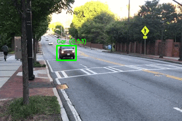

# TRG-net

This is the official code of TRG-Net, the proposal of our paper [A Lightweight Gaussian-Based Model for Fast Detection and Classification of Moving Objects](https://www.scitepress.org/PublicationsDetail.aspx?ID=bOi2/1Qh7c0=&t=1).



## Usage

Install with:

```bash
$ pip install -r requirements.txt
$ python setup.py install
```

Paste the pre-trained model in the following route: `~/.trgnet/checkpoints/`, feel free to send us an email for the `.pt` file. If you want to train the model by yourself review the [following guide]().

Finally, run the `sample.py` script to run the model and start detecting moving objects.

## Citation

```bibtex
@conference{visapp23trgnet,
  author={Joaquin Palma{-}Ugarte. and Laura Estacio{-}Cerquin. and Victor Flores{-}Benites. and Rensso Mora{-}Colque.},
  title={A Lightweight Gaussian-Based Model for Fast Detection and Classification of Moving Objects},
  booktitle={Proceedings of the 18th International Joint Conference on Computer Vision, Imaging and Computer Graphics Theory and Applications - Volume 5: VISAPP,},
  year={2023},
  pages={173-184},
  publisher={SciTePress},
  organization={INSTICC},
  doi={10.5220/0011697200003417},
  isbn={978-989-758-634-7},
  issn={2184-4321},
}
```
